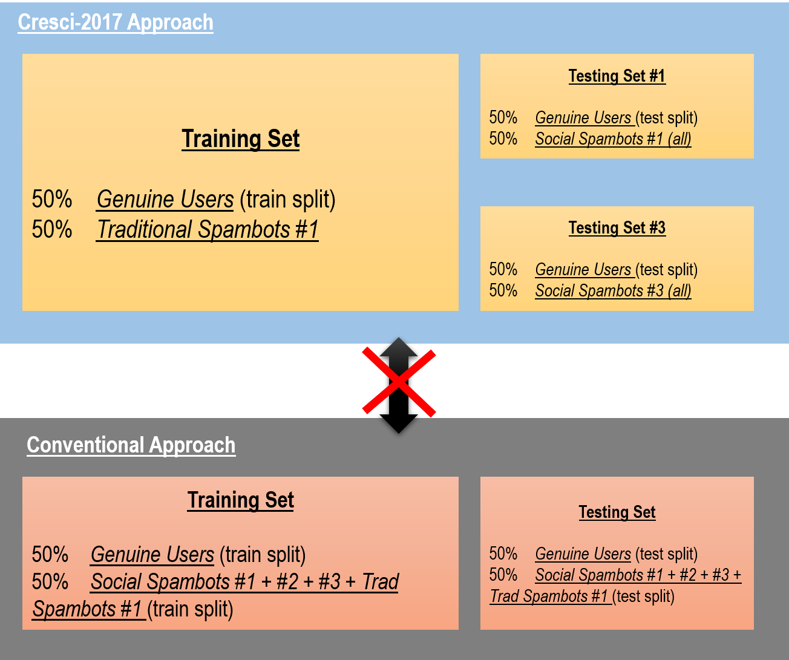
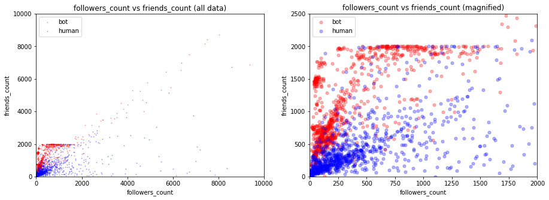
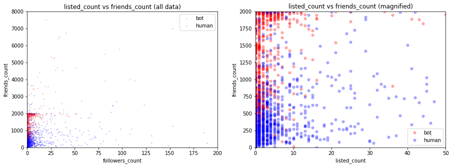
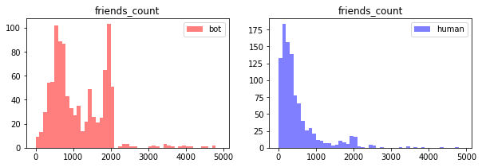
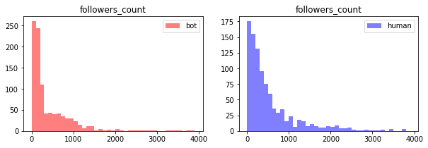
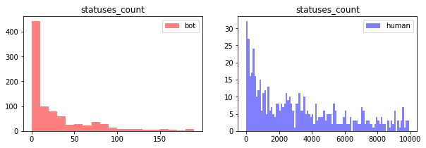
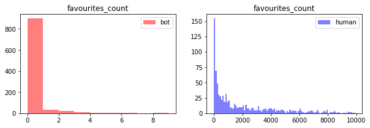

## 1. Introduction and Description of Data

We obtained the original dataset used in Cresci-2017 from Bot Repository[1]. The dataset consists of a number of datafiles, consisting of user data & tweets from genuine accounts as well as a range of different bot accounts. The background behind the choice and the methodology of obtaining the data is discussed extensively in Cresci-2017, and is summarized in the following table[2]:
 
| Dataset                 | Description                                             | Accounts | Tweets  | Year |
|-------------------------|---------------------------------------------------------|----------|---------|------|
| genuine accounts        |  Verified accounts that are human operated              | 3474     | 8377522 | 2011 |
| Social Spambots #1      | Retweeters of an Italian political candidate            | 991      | 1610176 | 2012 |
| Social Spambots #2      | Spammers of paid apps for mobile devices                | 3457     | 428542  | 2014 |
| Social Spambots #3      | Spammers of products on sale at Amazon.com              | 464      | 1418626 | 2011 |
| Traditional Spambots #1 | Training set of spammers used by Yang et al             | 1000     | 145094  | 2009 |
| Traditional Spambots #2 | Spammers of scam URLs                                   | 100      | 74957   | 2014 |
| Traditional Spambots #3 | Automated accounts spamming job offers                  | 433      | 5794931 | 2013 |
| Traditional Spambots #4 | Another group of automated accounts spamming job offers | 1128     | 133311  | 2009 |

From here, we constructed the training & testing dataset in identical manner to those presented in the paper. The methodology behind the construction of the data is summarized in the below chart. In essence, it can be described as follows:
* Training dataset is created by sampling 50% data of data from Genuine accounts, and 50% from **Traditional Spambots #1**.
* Testing dataset #1 is created by taking **all** data from Social Spambots #1, and equal number of samples from genuine accounts that were not used in creaging training dataset.
* Testing dataset #2 is created by taking **all** data from Social Spambots #2, and equal number of samples from genuine accounts that were not used in creating training dataset.

<p align="center">
  
</p>

* The important point that requires to be highlighted here is that Cresci-2017 approached the data preparation, NOT by creating a master dataset that consists of genuine and all types of bot accounts, and splitting to training/testing dataset, but the authors used **different bot datasets** for training set and testing set. 
* We initially took the abovementioned 'conventional approach', inspired by the data-processing techniques that we learned in CS109 course, however this resulted in generating unrealistically high accuracy scores for the test sets, therefore we reverted to the methodologies applied in Cresci-2017.

## 2. Data Cleaning

The raw dataset consists of a large number of observation types from users' tweets themselves, to number of friends, number of hashtags, number of followers and so on. In seeking to extract the information that may become powerful predictors. After widely exploring the relevant literature for varaible selection, we refered to a research by Manthan Shah and Vatsal Gopani [3] for selecting relevant variable as well as cleaning them to be fed into models.The cleaning process is presented below.

### 2.1 Narrowing columns 

```python
#download data for genuine users

df_gen_users = pd.read_csv('datasets_full.csv/genuine_accounts.csv/users.csv')

#define columns to keep for investigation

columns_to_keep = ['id', 'name', 'screen_name', 'statuses_count', 'followers_count',
       'friends_count', 'favourites_count', 'listed_count', 'url', 'lang',
       'time_zone', 'location', 'default_profile', 'default_profile_image',
       'geo_enabled', 'profile_image_url', 'profile_banner_url',
       'profile_use_background_image', 'profile_background_image_url_https',
       'profile_text_color', 'profile_image_url_https','follow_request_sent', 
       'verified','description', 'following']
```

### 2.2 Cleaning categorical values to binary values 

```python
#define data cleaning functions
#cleaning step 1: check if screen_name has a word 'bot' in it

def screen_name_check (df):
    
    word = 'bot'
    bot_name = []
    k = 0

    for i in range (len(df)):
        if pd.isnull(df.iloc[i,:]['screen_name']):
                k = 0
        else: 
            if word in df.iloc[i,:]['screen_name']:
                k = 1
            else:
                k = 0
        bot_name.append(k)
    
    return bot_name


#cleaning step 2: check if location parameter is present

def location_check(df):
    
    loc = []

    for i in range (len(df)):
        if pd.isnull(df.iloc[i,:]['location']):
            loc.append(0)
        else:
            loc.append(1)
            
    return loc

# cleaning step 3
# Set description to 1 if it contains either of these words: 
#‘bot’, ‘robot’, ‘artificial’, ‘intelligence’, ‘neural’, ‘network’, ‘automatic’ and 0 otherwise.

def description_check(df):
    keyword = ['bot', 'robot', 'artificial', 'intelligence', 'neural', 'network', 'automatic']
    bot_des = []
    k = 0

    for i in range (len(df)):
        for keyword in keyword:
            if pd.isnull(df.iloc[i,:]['description']):
                k = 0
            else:
                if df.iloc[i,:]['description'].find(keyword) == -1:
                    k = 0
                else:
                    k = 1
        bot_des.append(k)
        
    return bot_des

#cleaning step 4:
#Set verified to 1 if the sample’s verified features contents are True and 0 otherwise.

def verified_check(df):
    ver = []

    for i in range (len(df)):
        if pd.isnull(df.iloc[i,:]['verified']):
            ver.append(0)
        else:
            ver.append(1)
    return ver

#cleaning step 5:
#Check if default profile exists or not.

def default_profile_check (df):
    
    default_profile = []

    for i in range (len(df)):
        if pd.isnull(df.iloc[i,:]['default_profile']):
            default_profile.append(0)
        else:
            default_profile.append(1)
    
    return default_profile

#cleaning step 6:
#Check if default profile image is used or not.

def default_image_check (df):
    
    default_profile_image = []

    for i in range (len(df)):
        if pd.isnull(df.iloc[i,:]['default_profile_image']):
            default_profile_image.append(0)
        else:
            default_profile_image.append(1)
    
    return default_profile_image
```

```python
def master_clean (df):
    bot_name = screen_name_check (df)
    loc = location_check (df)
    bot_des = description_check (df)
    ver = verified_check (df)
    default_profile = default_profile_check (df)
    default_profile_image = default_image_check (df)
    
    df = pd.DataFrame({'screen_name': df['screen_name'],
                       'name': df['name'],
                       'bot_in_name':bot_name,
                       'bot_in_des':bot_des,
                       'location': loc,
                       'verified': ver,
                       'default_profile': default_profile,
                       'default_profile_image': default_profile_image,
                       'followers_count': df['followers_count'],
                       'listed_count': df['listed_count'],
                       'friends_count': df['friends_count'],
                       'favourites_count': df['favourites_count'],
                       'statuses_count': df['statuses_count'],
                       'bot_or_not':df['bot']
                       })
    
    return df
```

## 3. EDA

After cleaning the data, we perform an initial analysis of the number of friends, number of followers and the number of lists the user is part of for both humans and bots. 



**Comments**
* Bots have significantly more friends than followers. It appears as if bots recklessly add as many friends as possible. This complements the theory on bots regarding bots existing primarily to tweet, re-tweet statuses which promote their agenda. This behavior is different from humans as humans (in ideak world) use twitter as a medium of exchange of information and are interested in both receiving and sending tweets.

* We find that humans, on average are part of more lists than bots. One interpretation can be that, humans have more agency and need to organize their followers into lists for easier and efficient consumption of information. Bots one can argue, have no need for any classification of  information. 



* There are a couple of important observations to glean from this. First, it supplements the observations on friends_count, followers_count and listed_count made above. Second, the behavior of bots is starkly different from humans in favourites_counts and statuses_count. Bots mark nearly zero statuses as favorite and bots don’t tweet as well. 

* We do a further breakdown of the five parameters for both, bot and human, to understand  how bots operate in the twitter space. 


* This gives detailed information of how friends of bots differ from friends of humans. 






* Between the two graphs above, we get a deeper understanding of how the bots really operate. From our analysis, the bot twitter space can be thought of as being divided into two distinct buckets, one with bots of 0 followers and one with bots of 0 statuses. The bots in the bucket of  0 followers tweet and retweet in line with their agenda. The other bucket, bots with 0 statuses don’t tweet however follow others and contribute the number of fake followers a user has.




* Bots mark nearly zero statuses as favorite : how we understand this is, if bots exist to tweet or retweet their agenda or to increase the number of fake followers, they don’t need to mark statuses as favorite to do either. 


***
_[1] Bot Repository data download page (https://botometer.iuni.iu.edu/bot-repository/datasets.html)_  
_[2] Cresci-2017, page 2_  
_[3] Shad and Gopani https://www.youtube.com/watch?v=WYCZ6ZjfAJ0_


    
