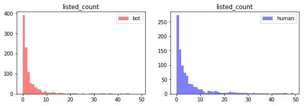

| Dataset                 | Description                                             | Accounts | Tweets  | Year |
|-------------------------|---------------------------------------------------------|----------|---------|------|
| genuine accounts        |  Verified accounts that are human operated              | 3474     | 8377522 | 2011 |
| Social Spambots #1      | Retweeters of an Italian political candidate            | 991      | 1610176 | 2012 |
| Social Spambots #2      | Spammers of paid apps for mobile devices                | 3457     | 428542  | 2014 |
| Social Spambots #3      | Spammers of products on sale at Amazon.com              | 464      | 1418626 | 2011 |
| Traditional Spambots #1 | Training set of spammers used by Yang et al             | 1000     | 145094  | 2009 |
| Traditional Spambots #2 | Spammers of scam URLs                                   | 100      | 74957   | 2014 |
| Traditional Spambots #3 | Automated accounts spamming job offers                  | 433      | 5794931 | 2013 |
| Traditional Spambots #4 | Another group of automated accounts spamming job offers | 1128     | 133311  | 2009 |


```python

```


    <matplotlib.legend.Legend at 0x1d645b6fe80>


```python
df = df_train

fig, ax = plt.subplots (2,3, figsize = (10,3))
fig.subplots_adjust(bottom = -0.8, top = 1)

size = 5

```


    Text(0.5,0,'statuses_count')


```python
df = df_train

fig, ax = plt.subplots(1,2, figsize = (10, 3))
size = 0.5
alpha = 0.5

var1 = 'favourites_count'

ax[0].hist(df[df['bot_or_not']==1][var1],color = 'red',  alpha = alpha, label = 'bot',
           bins =np.arange(0, 10, 1))

ax[0].legend()

ax[1].hist(df[df['bot_or_not']==0][var1],color = 'blue', alpha = alpha, label = 'human',
          bins = np.arange(0, 10000, 100))
ax[1].legend()

ax[0].set_title(var1)
ax[1].set_title(var1)
```


    Text(0.5,1,'favourites_count')


```python
df = df_train

fig, ax = plt.subplots(1,2, figsize = (10, 3))
size = 0.5
alpha = 0.5

var2 = 'friends_count'

ax[0].hist(df[df['bot_or_not']==1][var2],color = 'red',  alpha = alpha, label = 'bot',
           bins =np.arange(0, 5000, 100))
ax[0].legend()

ax[1].hist(df[df['bot_or_not']==0][var2],color = 'blue', alpha = alpha, label = 'human',
          bins = np.arange(0, 5000, 100))
ax[1].legend()

ax[0].set_title(var2)
ax[1].set_title(var2)
```


    Text(0.5,1,'friends_count')


```python
df = df_train


fig, ax = plt.subplots(1,2, figsize = (10, 3))
size = 0.5
alpha = 0.5

var1 = 'followers_count'

ax[0].hist(df[df['bot_or_not']==1][var1],color = 'red',  alpha = alpha, label = 'bot',
           bins =np.arange(0, 4000, 100))

ax[0].legend()
ax[1].hist(df[df['bot_or_not']==0][var1],color = 'blue', alpha = alpha, label = 'human',
          bins = np.arange(0, 4000, 100))
ax[1].legend()

ax[0].set_title(var1)
ax[1].set_title(var1)
```


    Text(0.5,1,'followers_count')


```python
df = df_train


fig, ax = plt.subplots(1,2, figsize = (10, 3))
size = 0.5
alpha = 0.5

var1 = 'listed_count'

ax[0].hist(df[df['bot_or_not']==1][var1],color = 'red',  alpha = alpha, label = 'bot',
           bins =np.arange(0, 50, 1))

ax[0].legend()
ax[1].hist(df[df['bot_or_not']==0][var1],color = 'blue', alpha = alpha, label = 'human',
          bins = np.arange(0, 50, 1))
ax[1].legend()

ax[0].set_title(var1)
ax[1].set_title(var1)
```


    Text(0.5,1,'listed_count')





```python
df = df_train

fig, ax = plt.subplots(1,2, figsize = (10, 3))
size = 0.5
alpha = 0.5

var1 = 'statuses_count'

ax[0].hist(df[df['bot_or_not']==1][var1],color = 'red',  alpha = alpha, label = 'bot',
           bins =np.arange(0, 200, 10))

ax[0].legend()
ax[1].hist(df[df['bot_or_not']==0][var1],color = 'blue', alpha = alpha, label = 'human',
          bins = np.arange(0, 10000, 100))
ax[1].legend()

ax[0].set_title(var1)
ax[1].set_title(var1)
```


    Text(0.5,1,'statuses_count')


