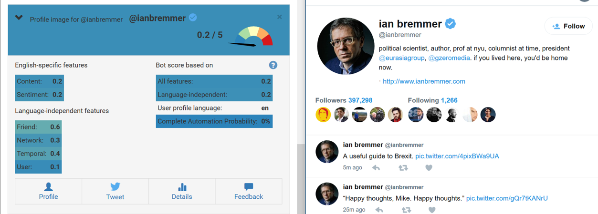

Our research will extensively refer to the following reasearch paper:  

***
**The paradigm-shift of social spambots: Evidence, theories, and tools for the arms race**  
_Stefano Cresci, Roberto Di Pietro, Marinella Petrocchi, Angelo Spognardi, Maurizio Tesconi_  
***

Our strong preference for the research and the dataset presented in Cresci-2017 is for the reliability of the labelling of users/tweets - whether they are generated by human or bots. Cresci had gone through extensive efforts to uphold a high standard while also achieveing to provide a large dataset, through a mixture of crowd-sourcing and rigorous sampler-selection. Cresci-2017 is frequently cited in the works of other researchers, as well as presented as an one of the official datasource for Bot Repository, a public website created by Indiana University who is also behind the creation of Botometer - a bot-detection software that is also extensively referred in this project.

It is worth noting that Cresci-2017 does not by itself present detailed methodology for bot detection, but consolidates a wide variety of methodologies available in the literature, and presents the performance of these models against their own dataset, which also provided us with a clear picture of the relevant work in the field, as well as tangible benchmarks for which we can target to achieve.

Crecsi-2017's comprehensive comparison of different bot-detection model is presented as below:

|        Techbique        |  Methodology |  Test Set 1 Accuracy |  Test Set 2 Accuracy |
|:-----------------------:|:------------:|:--------------------:|:--------------------:|
| Twitter countermeasures |     mixed    |         0.691        |         0.502        |
| Human Annotators        |    manual    |         0.698        |         0.829        |
| **BotOrNot?**               |  **supervised**  |         **0.734**        |         **0.911**        |
| **C. Yang et al.**          |  **supervised**  |         **0.506**        |         **0.629**        |
| Miller et al.           | unsupervised |         0.526        |         0.481        |
| Ahmed et al.            | unsupervised |         0.943        |         0.923        |
| Cresci et al.           | unsupervised |         0.976        |         0.929        |

(Cresci et al. 2017, page 6)

* As above chart shows, the accuracy score on two tests sets generated by Cresci-2017 varies significantly across models, and it is particularly interesting to note that human annotators do not perform as well as our intuition might suggest. 
* While it is clear that two unsupervised models proposed in Ahmed et al, and Cresci et al. perform far better than other models, for the scope of our research, we seek to achieve accuracy score at least as high as those achieved by **Yang et al.** since unsupervised models are beyond our current technical capabilities, but we are able to devise a range of supervised models.
* **BotOrNot?** Is a publicly available software that generates a score between 0 to 5, indicating the probability of whether a specific user account is automated twitter bot or not. This software is now known as Botometer. We also seek to refer to the accuracy levels achieved by Botometer as our higher benchmark to target.

_Example of Botometer assessing an account of @ianbremmer_

  

* Here the overall score of 0.2/5 indicated a high unlikelihood that this account is a automated bot.
* The breakdown of scores that contribute to the overall score can be seen, such as those from text analysis (content, sentiment), or from user-information (friend, network, temporal, user)

***

_botometer page (<https://botometer.iuni.iu.edu/#!/>)_