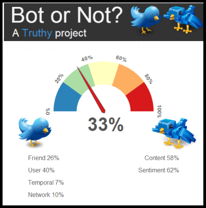

There are two relevant works that this projects heavily refers to two papers.

## Cresci-2017
**The paradigm-shift of social spambots: Evidence, theories, and tools for the arms race** 
Stefano Cresci, Roberto Di Pietro, Marinella Petrocchi, Angelo Spognardi, Maurizio Tesconi

Cresci-2017 approaches the topic of automated twitter-bots detection 

* Creation of datasets consisting of sample tweets and user data that are labelled as ‘genuine user’ or ‘bots’. Cresci-2017 goes through extensive efforts to ensure the accuracy of the correct labelling of the users while achieving to generate a large sample size, applying both crowd-sourcing and rigorous verification methodologies. 
* Cresci-2017 then applied as range of models that are proposed in the literature, and compares the performance of the models in comprehensive manner. 

|        Techbique        |  Methodology |  Test Set 1 Accuracy |  Test Set 2 Accuracy |
|:-----------------------:|:------------:|:--------------------:|:--------------------:|
| Twitter countermeasures |     mixed    |         0.691        |         0.502        |
| Human Annotators        |    manual    |         0.698        |         0.829        |
| BotOrNot?               |  supervised  |         0.734        |         0.911        |
| **C. Yang et al.**          |  **supervised**  |         **0.506**        |         **0.629**        |
| Miller et al.           | unsupervised |         0.526        |         0.481        |
| Ahmed et al.            | unsupervised |         0.943        |         0.923        |
| Cresci et al.           | unsupervised |         0.976        |         0.929        |

(Cresci et al. 2017, page 6)

* As above chart shows, the accuracy score on two tests sets generated by Cresci-2017 varies significantly across models, and it is particularly interesting to note that human annotators do not perform as well as our intuition might suggest. 
* While it is clear that two unsupervised models proposed in Ahmed et al, and Cresci et al. perform far better than other models, for the scope of our research, we seek to achieve accuracy score at least as high as those achieved by **Yang et al.** since unsupervised models are beyond our current technical capabilities, but we are able to devise a range of supervised models.
* BotOrNot? Is a publicly available software that generates a score between 0 to 5, indicating the probability of whether a specific user account is automated twitter bot or not. This software is now known as Botometer. We also seek to refer to the accuracy levels achieved by Botometer as our higher benchmark to target.

## General Approach 

https://teksecurityblog.com/twitter-bots-not-up-my-skirt/

