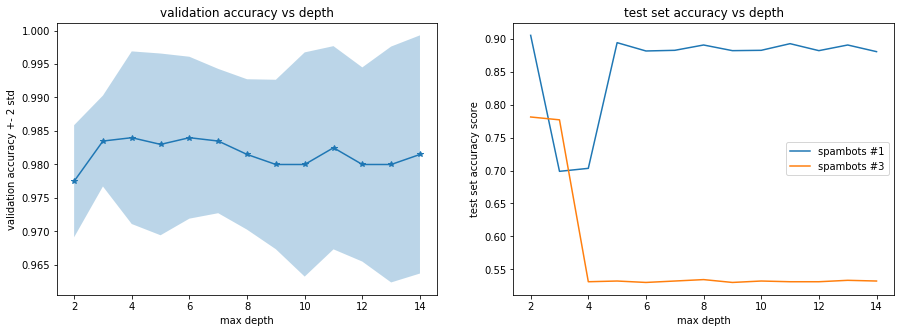

---
title: Models
notebook: EDA_Dec_2.ipynb
nav_include: 3
---

## 1. Stimple Decision Tree with Max Depth = 3

```python
decision_model = DecisionTreeClassifier(criterion='gini', splitter='best', max_depth=3)
decision_model.fit(X_train, y_train)

y_pred_train_dec = decision_model.predict(X_train)

y_pred_test_1_dec = decision_model.predict(X_test_1)
y_pred_test_3_dec = decision_model.predict(X_test_3)

train_score_dec = accuracy_score(y_train, y_pred_train_dec) * 100

test_score_1_dec = accuracy_score(y_test_1, y_pred_test_1_dec) * 100
test_score_3_dec = accuracy_score(y_test_3, y_pred_test_3_dec) * 100

print('accuracy score of the training set is {}%'.format(train_score_dec))
print('accuracy score of the test set with social spambot #1 is {}%'.format(test_score_1_dec))
print('accuracy score of the test set with social spambot #3 is {}%'.format(test_score_3_dec))

```


    accuracy score of the training set is 98.9%
    accuracy score of the test set with social spambot #1 is 69.87891019172552%
    accuracy score of the test set with social spambot #3 is 77.69396551724138%
    


```python
depth = np.arange(2,15,1)
decision_score_mean=[]
decision_score_std=[]
test_1_score = []
test_3_score = []

for i in depth:
    decision_model = DecisionTreeClassifier(criterion='gini', splitter='best', max_depth=i)
    decision_model.fit(X_train, y_train)
    score = cross_val_score(estimator = decision_model, X = X_train, y = y_train, cv = 5)
    decision_score_mean.append(score.mean())
    decision_score_std.append(score.std())
    test_1_score.append(accuracy_score(y_test_1, decision_model.predict(X_test_1)))
    test_3_score.append(accuracy_score(y_test_3, decision_model.predict(X_test_3)))
```


```python
fig, ax = plt.subplots(1,2, figsize = (15,5))

ax[0].plot(depth, decision_score_mean, '-*')
ax[0].fill_between(
    depth,
    np.array(decision_score_mean) - 2 * np.array(decision_score_std),
    np.array(decision_score_mean) + 2 * np.array(decision_score_std),
    alpha=.3)
ax[0].set_title('validation accuracy vs depth')
ax[0].set_xlabel('max depth')
ax[0].set_ylabel('validation accuracy +- 2 std')

ax[1].plot(depth, test_1_score)
ax[1].plot(depth, test_3_score)
ax[1].set_title('spambots3 test set accuracy vs depth')
ax[1].set_xlabel('max depth')
ax[1].set_ylabel('test set accuracy score')
```


    Text(0,0.5,'test set accuracy score')





```python
overfit_depth = 100
N = 100

bagging_model = BaggingClassifier(DecisionTreeClassifier(criterion='gini', splitter='best', max_depth=overfit_depth), 
                                  n_estimators = N, bootstrap = True, oob_score = True)
bagging_model.fit(X_train, y_train)

y_pred_train_bag = bagging_model.predict(X_train)

y_pred_test_1_bag = bagging_model.predict(X_test_1)
y_pred_test_3_bag = bagging_model.predict(X_test_3)

train_score_bag = accuracy_score(y_train, y_pred_train_bag) * 100

test_score_1_bag = accuracy_score(y_test_1, y_pred_test_1_bag) * 100
test_score_3_bag = accuracy_score(y_test_3, y_pred_test_3_bag) * 100

print('accuracy score of the training set is {}%'.format(train_score_bag))
print('accuracy score of the test set with social spambot #1 is {}%'.format(test_score_1_bag))
print('accuracy score of the test set with social spambot #3 is {}%'.format(test_score_3_bag))
```


    C:\Users\motoa\Anaconda3\lib\site-packages\sklearn\ensemble\bagging.py:618: DataConversionWarning: A column-vector y was passed when a 1d array was expected. Please change the shape of y to (n_samples, ), for example using ravel().
      y = column_or_1d(y, warn=True)
    

    accuracy score of the training set is 100.0%
    accuracy score of the test set with social spambot #1 is 84.81331987891019%
    accuracy score of the test set with social spambot #3 is 54.418103448275865%
    


```python
ada_model = AdaBoostClassifier(base_estimator=DecisionTreeClassifier(max_depth=3),  
                               n_estimators=800, learning_rate=0.05)

ada_model.fit(X_train, y_train)

y_pred_train_ada = ada_model.predict(X_train)
y_pred_test_1_ada = ada_model.predict(X_test_1)
y_pred_test_3_ada = ada_model.predict(X_test_3)


train_score_ada = accuracy_score(y_train, y_pred_train_ada) * 100
test_score_1_ada = accuracy_score(y_test_1, y_pred_test_1_ada) * 100
test_score_3_ada = accuracy_score(y_test_3, y_pred_test_3_ada) * 100

train_staged_score_ada = list(ada_model.staged_score(X_train, y_train))
test_staged_score_1_ada = list(ada_model.staged_score(X_test_1, y_test_1))
test_staged_score_3_ada = list(ada_model.staged_score(X_test_3, y_test_3))
```


    C:\Users\motoa\Anaconda3\lib\site-packages\sklearn\utils\validation.py:752: DataConversionWarning: A column-vector y was passed when a 1d array was expected. Please change the shape of y to (n_samples, ), for example using ravel().
      y = column_or_1d(y, warn=True)
    


```python
fig, ax = plt.subplots(1,3, figsize = (15,5))

ax[0].plot(np.arange(1, 801, 1), train_staged_score_ada)
ax[0].set_title("Training Set Accuracy Score")
ax[0].set_xlabel("number of iteration")
ax[0].set_ylabel("Accuracy Score")

ax[1].plot(np.arange(1, 801, 1), test_staged_score_1_ada)
ax[1].set_title("Test Set #1 Accuracy Score")
ax[1].set_xlabel("number of iteration")
ax[1].set_ylabel("Accuracy Score")

ax[2].plot(np.arange(1, 801, 1), test_staged_score_3_ada)
ax[2].set_title("Test Set #3 Accuracy Score")
ax[2].set_xlabel("number of iteration")
ax[2].set_ylabel("Accuracy Score")
```


    Text(0,0.5,'Accuracy Score')


```python

```


```python

```


```python
print('accuracy score of the training set is {}%'.format(train_score_ada))
print('accuracy score of the test set with social spambot #1 is {}%'.format(test_score_1_ada))
print('accuracy score of the test set with social spambot #3 is {}%'.format(test_score_3_ada))
```


    accuracy score of the training set is 100.0%
    accuracy score of the test set with social spambot #1 is 88.04238143289606%
    accuracy score of the test set with social spambot #3 is 52.90948275862068%
    


```python
overfit_depth = 100
N = 100

rf_model = RandomForestClassifier(n_estimators = N, criterion='gini', 
                                  max_features='auto', max_depth = overfit_depth, bootstrap=True,
                                 oob_score=True)

rf_model.fit(X_train, y_train)
y_pred_train = rf_model.predict(X_train)

y_pred_test_1 = rf_model.predict(X_test_1)
y_pred_test_3 = rf_model.predict(X_test_3)

train_score = accuracy_score(y_train, y_pred_train) * 100

test_score_1 = accuracy_score(y_test_1, y_pred_test_1) * 100
test_score_3 = accuracy_score(y_test_3, y_pred_test_3) * 100

oobs_score = rf_model.oob_score_

print('accuracy score of the training set is {}%'.format(train_score))
print('accuracy score of the test set with social spambot #1 is {}%'.format(test_score_1))
print('accuracy score of the test set with social spambot #3 is {}%'.format(test_score_3))

```


    C:\Users\motoa\Anaconda3\lib\site-packages\ipykernel_launcher.py:8: DataConversionWarning: A column-vector y was passed when a 1d array was expected. Please change the shape of y to (n_samples,), for example using ravel().
      
    

    accuracy score of the training set is 100.0%
    accuracy score of the test set with social spambot #1 is 84.05650857719476%
    accuracy score of the test set with social spambot #3 is 77.47844827586206%
    


```python
pd.Series(rf_model.feature_importances_,index=list(X_train)).sort_values().plot(kind="barh")
```


    <matplotlib.axes._subplots.AxesSubplot at 0x195ea451e48>


```python
# Multinominal Logistic Regression

log_model = LogisticRegressionCV(fit_intercept=True, cv=5, multi_class="ovr", penalty='l2', max_iter=10000)
log_model.fit(X_train, y_train.values.reshape(-1))

y_pred_train_log = log_model.predict(X_train)

y_pred_test_1_log = log_model.predict(X_test_1)
y_pred_test_3_log = log_model.predict(X_test_3)

train_score_log = accuracy_score(y_train, y_pred_train_log) * 100

test_score_1_log = accuracy_score(y_test_1, y_pred_test_1_log) * 100
test_score_3_log = accuracy_score(y_test_3, y_pred_test_3_log) * 100

print('accuracy score of the training set is {}%'.format(train_score_log))
print('accuracy score of the test set with social spambot #1 is {}%'.format(test_score_1_log))
print('accuracy score of the test set with social spambot #3 is {}%'.format(test_score_3_log))
```


    accuracy score of the training set is 97.55%
    accuracy score of the test set with social spambot #1 is 69.02119071644803%
    accuracy score of the test set with social spambot #3 is 51.724137931034484%
    


```python
# K Nearest Neighbours

def normalize (df):
    con_var = ['followers_count', 'listed_count', 'friends_count', 'favourites_count', 'statuses_count']

    for var in con_var:
        x = df[var]
        x = (x - x.mean())/x.std()
        df[var] = x
    
    return df

X_train_norm = normalize(X_train)
X_test_1_norm = normalize(X_test_1)
X_test_3_norm = normalize(X_test_3)
```


```python
kvals = [1, 2, 5, 7, 10, 15, 20, 25, 30, 50]
knn_score_train = []

for i in kvals:
    model_knn = KNeighborsClassifier(n_neighbors=i, weights = 'uniform')
    train_score = cross_val_score(model_knn, X = X_train_norm, y = y_train.values.reshape(-1), cv=5)
    knn_score_train.append(train_score.mean())

fig, ax = plt.subplots(1,1, figsize = (12,5))

ax.plot(kvals, knn_score_train)
ax.set_title("Train Set Score")
ax.set_xlabel("kvals")
ax.set_ylabel("Mean Accuracy Score")
```


    Text(0,0.5,'Mean Accuracy Score')


```python
knn_model = KNeighborsClassifier(n_neighbors=10,weights = 'uniform')
knn_model.fit(X_train, y_train.values.reshape(-1))

y_pred_train_knn = knn_model.predict(X_train)

y_pred_test_1_knn = knn_model.predict(X_test_1)
y_pred_test_3_knn = knn_model.predict(X_test_3)

train_score_knn = accuracy_score(y_train, y_pred_train_knn) * 100

test_score_1_knn = accuracy_score(y_test_1, y_pred_test_1_knn) * 100
test_score_3_knn = accuracy_score(y_test_3, y_pred_test_3_knn) * 100

print('accuracy score of the training set is {}%'.format(train_score_log))
print('accuracy score of the test set with social spambot #1 is {}%'.format(test_score_1_knn))
print('accuracy score of the test set with social spambot #3 is {}%'.format(test_score_3_knn))
```


    accuracy score of the training set is 97.55%
    accuracy score of the test set with social spambot #1 is 63.97578203834511%
    accuracy score of the test set with social spambot #3 is 68.53448275862068%
    
