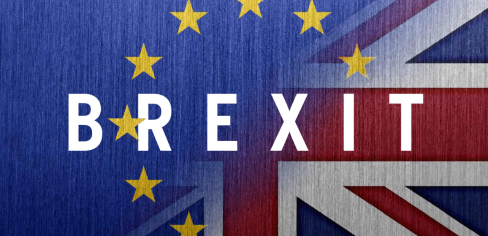
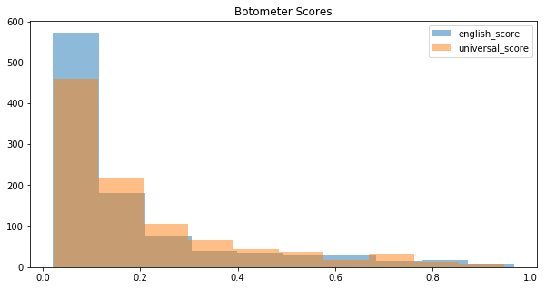

<p align="left">
  
</p>

## 1. Application to current datasource
One of the biggest challenges that the research community, including the Twitter developpers themselves, face is the increasing sophistication of automated bots and their growing ability to mimic human behaviours. In our strong desire to work with datasets with high reliability of the correct identification of human users and automated bots, our research was heavily focused on the studies carried out by Cresci-2017 and associated data presented by the study.

The natural progression from here would be to apply our models to the 'real' tweets that are obtained from the most current times. We then go back to our starting point, how do we know which tweets are generated by humans and which are by automated bots? In our attempt to make a progress here, we decided to experiment with Botometer (previously BotOrNot?) API, which was shown earlier to perform well in identifying automated bots, to act as the third-party verifier whose predictions we may take as the 'ground-truth' of the bot-or-human question.

### 1.1 Choice of Data
We used the twitter API (tweepy) to download 'current' tweeter and associated user data. Given that our base research - Cresci-2017 - had a strong focus on twitter bot usage of political nature, we decided to download tweets that are (i) of current topic, and (ii) has strong political associations. Recent turmoil in the UK in relation to Brexit seem to perfectly fit these aspects, and we downloaded 2000 tweets on 10th December 2018 through twitter API.
The sample size was intentionally selected to 2000 as Botometer API had a daily usage cap of 2000, and we further discovered that verification process take significant amount of time, therefore 2000 seemed a realistic sample size for us to investigate, as well as for others to engage in a similar investigation under realistic timeline.

### 1.2 Botometer API
Botometer API provides identical results to those available on their website, utlimately providing a score for each **user** between 0 to 5, 0 being most human, 5 being least human. Anything above 2.5 may be considered as a bot. Botometer also provides a breakdown of scores that they incorporated to reach the final score, such as 'english' (text analysis), 'friends', 'network', 'sentiments' etc, not dissimilar to our modelling approach. An example of Botometer API output is shown below.

```python
```
    {'cap': {'english': 0.0038317559975942547, 'universal': 0.004725361816828223},
     'categories': {'content': 0.19935698741177266,
      'friend': 0.1594575816736603,
      'network': 0.44801550652707667,
      'sentiment': 0.09785188233608959,
      'temporal': 0.08388930474225163,
      'user': 0.07248797510053138},
     'display_scores': {'content': 1.0,
      'english': 0.5,
      'friend': 0.8,
      'network': 2.2,
      'sentiment': 0.5,
      'temporal': 0.4,
      'universal': 0.5,
      'user': 0.4},
     'scores': {'english': 0.10030935716061677, 'universal': 0.10328573467123618},
     'user': {'id_str': '344141508', 'screen_name': 'Manuel_TSSA'}}

### Obtaining Botometer score for recent Brexit tweets
Given the time constraints presented by the verification process for Botometer API, we further narrowed down the sample size to 1000, and obtained the scores as presented below.


## Botometer Score


As shown above, Botometer had detected ALL of the 1000 tweets/users as highly likely to be human, with even the highest score at below 1 (out of 5). Breakdown of scores are also shown below.

## Breakdown of scores


The breakdown does show that some users scored highly on certain parameters to be highly likely to be bots, but considered as a whole, they were deemed unlikely to be bots.

## 2. Further Scope
This result unfortuantely prevented us from going forward, as we could not generate sufficient 'bot' datasets to test the performance of our models. The clear next step forward for our project would be increase the sample size of current tweets, generate sufficient number of bots through reliable third-party sources such as botometer, and test our best performing model in predicting the automated bots.

