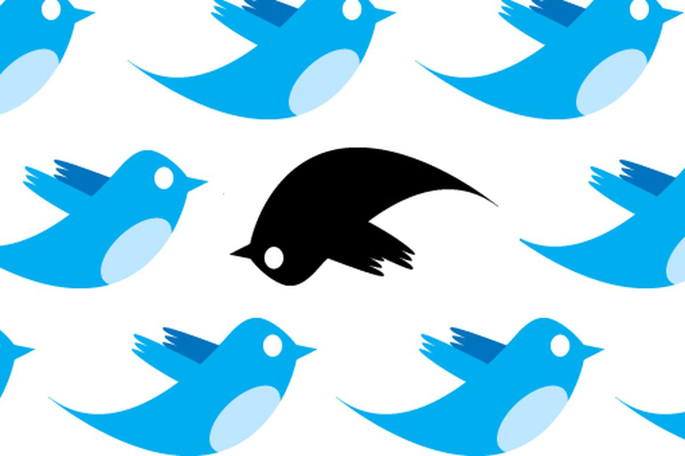

  

Munmun, Daisuke, Motoaki (Group 48)

***

## Motivation

There is an increasing prevalence of tweets generated by automated twitter accounts or 'bots' amidst the backdrop of the exponential growth of twitter usage in recent years. The intensions behind the creation of these tweets are varied, from non-malicious ones such as those created by the government agencies in order to promptly alert the public to an adverse weather events, to malicious ones – seeking to manipulate the twitter community for commercial or political purposes. A simple ‘bot’ may be designed to follow a politician in order to increase the figure’s follower counts. A more complicated ‘bot’ may send out automated tweets that resemble human tweets, with similar intentions to influence the public discourse. The official Twitter platform has done much work in detecting these automated ‘bots’ with malicious intents, seeking to block them from the platform. However, growing sophistication of the 'bots' is making the process of detection increasingly difficult for the Twitter as well as the research community. Social Media, including twitter, has never been more important in our society, and we believe that the attempts to detect malicious bots would be a deeply meaningful exercise.

***

## General Approach 

As we sought to detect the behavioural patterns of the ‘bots’ and apply classification models to detect them, we stumbled upon a simple question which became our starting point.

>how can we devise a reliable model if we don’t know what the right answer is?

In our commitment to adhere to scientific methods, we ruled out a number of approaches suggested on the internet, and focused on approaches suggested in the paper “The paradigm-shift of social spambots: Evidence, theories, and tools for the arms race (Cresci-2017)”, for the researchers have gone through extensive and rigorous efforts to generate a dataset consisting of a large sample size of genuine twitter users and twitter bots, and they have generously published the relevant data on BotRepository[2], which provided an ideal environment upon which for us to carry out this project.

***

## Overview:
Our general approach and objective may be summarized as follows:

* Explore dataset published by Cresci-2017
* Devise Classification Models to detect genuine twitter users and automated bots
* Seek to increase the Models' performance by incorporating text analysis
* Evaluate our methodologies and identify futher scopes

We would like thank the members of CS109 faculty for their support, and also pay a very special thanks to our team TA who provided us with valuable guidance throughout the research process.

***

_team Github page (<https://github.com/motoakisumi>)_  
_picture source (<https://www.theverge.com/2017/8/13/16125852/identify-twitter-bot-botometer-spambot-program>)_  
_bot repository (<https://botometer.iuni.iu.edu/bot-repository/index.html>)_  
_cresci_2017(<https://arxiv.org/abs/1701.03017>)_