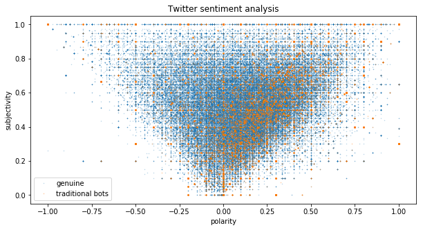
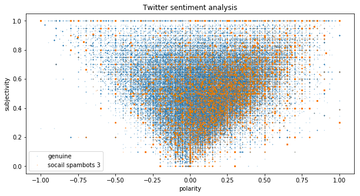
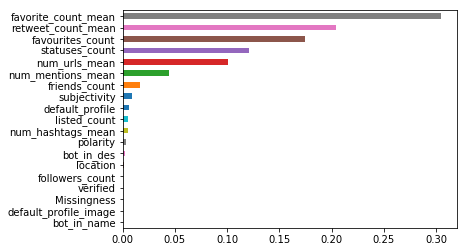
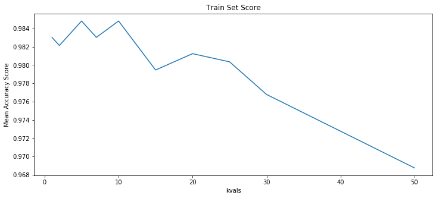
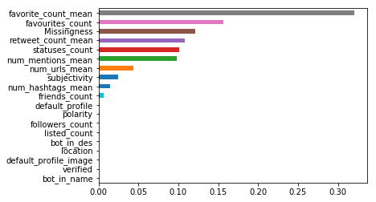
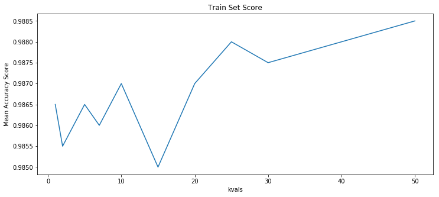
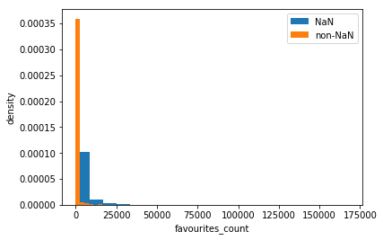

## 1. Sentimental and Text Analysis
* After exploring various text analysis methodolgies available in the literature, we selected Sentimental Analysis via Python package names TextBlob to generate additional predictors based on text analysis.
* TextBlob analyzes the texts contained in a sentense (ideal for tweet analysis) and give two scores for the sentence: (i) polarity and (ii) subjectivity. Both variables range between -1 and 1, indicating the positivity/negativity of each factor.
* At the same time, we included text-related features in our model. Those are the average number of retweets, favorites, hashtags, urls, and mentions in a tweet.
* At this stage, we have eliminated Test Set #1 from Social Spambots #1, since more than 99% of tweets are in Italian (as the data was sampled in relation to an Italian election), and Textblob is only able to analyze English tweets.
* We found that there are mismatches between users of user data and users of tweet data, and in consequence, there appeared a large number of missing data for these text data. In order to deal with these missing data, we examined (1) dropping rows with missing data and (2) linear regression imputation.

## 1.1 Obtaining the sentiment score
We apply a standard methodology available in the literature for obtaining the sentiment score.

```python
def clean_tweet(tweet): 
    if pd.isnull(tweet):
        return 'neutral'
    else:
        return ' '.join(re.sub("(@[A-Za-z0-9]+)|([^0-9A-Za-z \t])|(\w+:\/\/\S+)", " ", tweet).split())

def get_tweet_sentiment(tweet): 
    ''' 
    Utility function to classify sentiment of passed tweet 
    using textblob's sentiment method 
    '''
    # create TextBlob object of passed tweet text 
    analysis = TextBlob(clean_tweet(tweet)) 
    # set sentiment 
    if analysis.sentiment.polarity > 0: 
        return 'positive'
    elif analysis.sentiment.polarity == 0: 
        return 'neutral'
    else: 
        return 'negative'
    
def get_score(tweet): 

    # create TextBlob object of passed tweet text 
    analysis = TextBlob(clean_tweet(tweet)) 
    # set sentiment 
    return analysis.sentiment.polarity, analysis.sentiment.subjectivity
```

## 1.2 Analyzing the sentiments between human tweets and bot tweets.

```python
fig, ax = plt.subplots(1,1, figsize =(10,5))

ax.plot(gen_sent['polarity'].values, gen_sent['subjectivity'].values, 'o', markersize = 0.5, alpha = 0.3, label = 'genuine')
ax.plot(trad_bot1_sent['polarity'].values, trad_bot1_sent['subjectivity'].values, 'o', markersize = 0.7, alpha = 0.3, label ='traditional bots')
ax.set_xlabel('polarity')
ax.set_ylabel('subjectivity')
ax.set_title('Twitter sentiment analysis')
ax.legend()
```


```python
fig, ax = plt.subplots(1,1, figsize =(10,5))

ax.plot(gen_sent['polarity'].values, gen_sent['subjectivity'].values, 'o', markersize = 0.5, alpha = 0.3, label = 'genuine')
ax.plot(ss_bot3_sent['polarity'].values, ss_bot3_sent['subjectivity'].values, 'o', markersize = 0.7, alpha = 0.3, label ='socail spambots 3')
ax.set_xlabel('polarity')
ax.set_ylabel('subjectivity')
ax.set_title('Twitter sentiment analysis')
ax.legend()
```


* It appears sentimental scores for human and bot tweets are spread out across the spectrum, with no clear separation between the two types. However, some clustering of bot data can be observed for both sample sets, in the positive polarity area. These may become interesting additional predictors.


## 2. Dropping missing data
### 2.1. Model Preparation
By dropping missing data, our sample number decreased. The number of samples are 1120 for training data and 386 for test data.
```python
We standardized conitunous variables to equally treat features.
# standardize dataset
def standardize (df,df_train):
    con_var = ['followers_count', 'listed_count', 'friends_count', 'favourites_count', 'statuses_count',
               'retweet_count_mean','favorite_count_mean','num_hashtags_mean','num_urls_mean','num_mentions_mean',
              'polarity','subjectivity']

    for var in con_var:
        x = df[var]
        x = (x - x.mean())/x.std()
        df[var] = x
    
    return df

X_train_norm = standardize(X_train,X_train)
X_test_3_norm = standardize(X_test_3,X_train)
X_train_norm_dn = standardize(X_train_dn,X_train_dn)
X_test_3_norm_dn = standardize(X_test_dn,X_train_dn)
```

### 2.2. Results
The model we used is same as the one we used in our Main model.
### 2.2.1 Decision Tree

    accuracy score of the training set is 100.0%
    accuracy score of the test set with social spambot #3 is 95.07772020725389%

### 2.2.2 Bagging

    accuracy score of the training set is 100.0%
    accuracy score of the test set with social spambot #3 is 95.07772020725389%

### 2.2.3 Boosting

    accuracy score of the training set is 100.0%
    accuracy score of the test set with social spambot #3 is 95.07772020725389%


### 2.2.4 Random Forests

    accuracy score of the training set is 100.0%
    accuracy score of the test set with social spambot #3 is 96.6321243523316%



### 2.2.5 Multinomial Logistic Regression

    accuracy score of the training set is 100.0%
    accuracy score of the test set with social spambot #3 is 95.59585492227978%

### 2.2.6 kNN



    accuracy score of the training set is 100.0%
    accuracy score of the test set with social spambot #3 is 91.19170984455958%

 
## 3. Linear Regression Imputation
### 3.1 Model Preparation
In order to examine whether the missinness is at random or not, we included a column which shows missingness of the row. Then we imputed missing data by linear regression using the complete data from the user dataset.
```python
#add a feature of missingness
def add_missingness(df):
    inds = np.where(df.isnull())
    inds = np.array(inds).tolist()
    inds
    inds_list = []
    for i in inds[0]:
        if i not in inds_list:
            inds_list.append(i)
    df["Missingness"] = 0
    for i in inds_list:
        df.iloc[i,-1] = 1
    return df
```
```python
df_train_2=add_missingness(df_train)
df_test_3_2=add_missingness(df_test_3)
```
```python
# index of rows which contain NaN
inds = np.where(df_train_2.isna())
inds = np.array(inds).tolist()
inds_list = []
for i in inds[0]:
    if i not in inds_list:
        inds_list.append(i)
```
```python
#linear regression imputation
from sklearn.linear_model import LinearRegression

def linear_imputation(df,columns_withna):
    df2=df.copy()
    df3=df.copy()
    df2=df2.drop(columns=["screen_name","name"])
    df_dropna=df2.dropna()
    for feature in columns_withna:
        x_set = df_dropna[df_dropna.columns.difference(columns_withna)]
        y_set = df_dropna[feature]
        
        linear_reg = LinearRegression()
        linear_reg.fit(x_set,y_set)
        ytest_hat = linear_reg.predict(df2[df2.columns.difference(columns_withna)])
        df3[feature]=ytest_hat
    df3.update(df)
    return df3
```
```python
df_train_3 = linear_imputation(df_train_2, columns_to_keep_nan)
df_test_3_3 = linear_imputation(df_test_3_2, columns_to_keep_nan)
```
The number of samples are 2000 for training data and 928 for test data.

```python
# standardize dataset

def standardize (df,df_train):
    con_var = ['followers_count', 'listed_count', 'friends_count', 'favourites_count', 'statuses_count',
               'retweet_count_mean','favorite_count_mean','num_hashtags_mean','num_urls_mean','num_mentions_mean',
              'polarity','subjectivity']

    for var in con_var:
        x = df[var]
        x = (x - x.mean())/x.std()
        df[var] = x
    
    return df

X_train_norm = standardize(X_train,X_train)
X_test_3_norm = standardize(X_test_3,X_train)
X_train_norm_dn = standardize(X_train_dn,X_train_dn)
X_test_3_norm_dn = standardize(X_test_dn,X_train_dn)
```

### 3.2 Results
### 3.2.1 Decision Tree

    accuracy score of the training set is 100.0%
    accuracy score of the test set with social spambot #3 is 49.0301724137931%

### 3.2.2 Bagging

    accuracy score of the training set is 100.0%
    accuracy score of the test set with social spambot #3 is 94.07327586206897%


### 3.2.3 Boosting

    accuracy score of the training set is 100.0%
    accuracy score of the test set with social spambot #3 is 82.4353448275862%

### 3.2.4 Random Forests
  
    accuracy score of the training set is 100.0%
    accuracy score of the test set with social spambot #3 is 83.1896551724138%




### 3.2.5 Multinomial Logistic Regression

    accuracy score of the training set is 99.95%
    accuracy score of the test set with social spambot #3 is 95.6896551724138%


### 3.2.6 kNN



    accuracy score of the training set is 100.0%
    accuracy score of the test set with social spambot #3 is 92.88793103448276%

## 4. Summary

### 4.1 Comparison of model performance

| Model               | Test score #3(main model) | Test score #3(dropNaN) | Test score #3(linear imputation) |
|---------------------|-------------|---------------|---------------|
| Decision Tree       | 77.7%       | 95.1%         | 49.0%         |
| Bagging             | 54.4%        | 95.1%         | 94.1%         |
| Boosting            | 52.9%        | 95.1%         | 82.4%         |
| Random Forest       | 77.5%        | 96.7%         | 83.2%         |
| Logistic Regression | 51.7%       | 95.6%         | 95.7%         |
| KNN                 | 67.2%       | 91.2%         | 92.9%         |

* We were able to obtain higher test scores in general with our combined dataset with sentiment and text features. The highest test score was 96.7% with Random Forest model from the dataset which dropped missing data. 
* By employing Random Forest, we found that the important features to detect bots are faviorite count both per tweet and user, and status count. Subjectivity from the sensitive analysis contributed as well. However, the significance of coefficient of missingness made us suspicious about the randomness of missing data.

* Above figure shows that there is a clear separation between data with missing data and data without missing data in terms of favourite count (one of the most important feature). Thus, we cannot deny the fact that dropping or imputing missing data creates bias in our model.