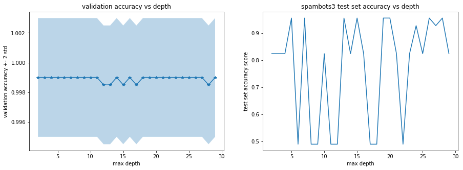

## 1. Sentimental and Text Analysis
* After exploring various text analysis methodolgies available in the literature, we selected Sentimental Analysis via Python package names TextBlob to generate additional predictors based on text analysis.
* TextBlob analyzes the texts contained in a sentense (ideal for tweet analysis) and give two scores for the sentence: (i) polarity and (ii) subjectivity. Both variables range between -1 and 1, indicating the positivity/negativity of each factor.
* At the same time, we included text-related features in our model. Those are the average number of retweets, favorites, hashtags, urls, and mentions in a tweet.
* At this stage, we have eliminated Test Set #1 from Social Spambots #1, since more than 99% of tweets are in Italian (as the data was sampled in relation to an Italian election), and Textblob is only able to analyze English tweets.
* We found that there are mismatches between users of user data and users of tweet data, and in consequence, there appeared a large number of missing data for these text data. In order to deal with these missing data, we examined (1) dropping rows with missing data and (2) linear regression imputation.

## 1.1 Obtaining the sentiment score
We apply a standard methodology available in the literature for obtaining the sentiment score.

```python
def clean_tweet(tweet): 
    if pd.isnull(tweet):
        return 'neutral'
    else:
        return ' '.join(re.sub("(@[A-Za-z0-9]+)|([^0-9A-Za-z \t])|(\w+:\/\/\S+)", " ", tweet).split())

def get_tweet_sentiment(tweet): 
    ''' 
    Utility function to classify sentiment of passed tweet 
    using textblob's sentiment method 
    '''
    # create TextBlob object of passed tweet text 
    analysis = TextBlob(clean_tweet(tweet)) 
    # set sentiment 
    if analysis.sentiment.polarity > 0: 
        return 'positive'
    elif analysis.sentiment.polarity == 0: 
        return 'neutral'
    else: 
        return 'negative'
    
def get_score(tweet): 

    # create TextBlob object of passed tweet text 
    analysis = TextBlob(clean_tweet(tweet)) 
    # set sentiment 
    return analysis.sentiment.polarity, analysis.sentiment.subjectivity
```

## 1.2 Analyzing the sentiments between human tweets and bot tweets.

```python
fig, ax = plt.subplots(1,1, figsize =(10,5))

ax.plot(gen_sent['polarity'].values, gen_sent['subjectivity'].values, 'o', markersize = 0.5, alpha = 0.3, label = 'genuine')
ax.plot(trad_bot1_sent['polarity'].values, trad_bot1_sent['subjectivity'].values, 'o', markersize = 0.7, alpha = 0.3, label ='traditional bots')
ax.set_xlabel('polarity')
ax.set_ylabel('subjectivity')
ax.set_title('Twitter sentiment analysis')
ax.legend()
```


```python
fig, ax = plt.subplots(1,1, figsize =(10,5))

ax.plot(gen_sent['polarity'].values, gen_sent['subjectivity'].values, 'o', markersize = 0.5, alpha = 0.3, label = 'genuine')
ax.plot(ss_bot3_sent['polarity'].values, ss_bot3_sent['subjectivity'].values, 'o', markersize = 0.7, alpha = 0.3, label ='socail spambots 3')
ax.set_xlabel('polarity')
ax.set_ylabel('subjectivity')
ax.set_title('Twitter sentiment analysis')
ax.legend()
```


* It appears sentimental scores for human and bot tweets are spread out across the spectrum, with no clear separation between the two types. However, some clustering of bot data can be observed for both sample sets, in the positive polarity area. These may become interesting additional predictors.

## 1.3 Model preparation


## 2. Dropping missing data
## 2.1. Model Preparation

```python
#add a feature of missingness
def add_missingness(df):
    inds = np.where(df.isnull())
    inds = np.array(inds).tolist()
    inds
    inds_list = []
    for i in inds[0]:
        if i not in inds_list:
            inds_list.append(i)
    df["Missingness"] = 0
    for i in inds_list:
        df.iloc[i,-1] = 1
    return df
```

```python
df_train_2=add_missingness(df_train)
df_test_3_2=add_missingness(df_test_3)
```
```python
# standardize dataset

def standardize (df,df_train):
    con_var = ['followers_count', 'listed_count', 'friends_count', 'favourites_count', 'statuses_count',
               'retweet_count_mean','favorite_count_mean','num_hashtags_mean','num_urls_mean','num_mentions_mean',
              'polarity','subjectivity']

    for var in con_var:
        x = df[var]
        x = (x - x.mean())/x.std()
        df[var] = x
    
    return df

X_train_norm = standardize(X_train,X_train)
X_test_3_norm = standardize(X_test_3,X_train)
X_train_norm_dn = standardize(X_train_dn,X_train_dn)
X_test_3_norm_dn = standardize(X_test_dn,X_train_dn)
```

## 2.2. Results
### 2.2.1 Decision Tree

```python
# Simple Decision Tree with dropna

decision_model = DecisionTreeClassifier(criterion='gini', splitter='best', max_depth=3)
decision_model.fit(X_train_dn, y_train_dn)

y_pred_train_dec = decision_model.predict(X_train_norm_dn)
y_pred_test_3_dec = decision_model.predict(X_test_3_norm_dn)

train_score_dec = accuracy_score(y_train_dn, y_pred_train_dec) * 100
test_score_3_dec = accuracy_score(y_test_dn, y_pred_test_3_dec) * 100

print('accuracy score of the training set is {}%'.format(train_score_dec))
print('accuracy score of the test set with social spambot #3 is {}%'.format(test_score_3_dec))
```


    accuracy score of the training set is 100.0%
    accuracy score of the test set with social spambot #3 is 95.07772020725389%

### 2.2.2 Bagging

```python
# bagging with dropna
overfit_depth = 100
N = 100

bagging_model = BaggingClassifier(DecisionTreeClassifier(criterion='gini', splitter='best', max_depth=overfit_depth), 
                                  n_estimators = N, bootstrap = True, oob_score = True)
bagging_model.fit(X_train_norm_dn, y_train_dn)

y_pred_train_bag = bagging_model.predict(X_train_norm_dn)
y_pred_test_3_bag = bagging_model.predict(X_test_3_norm_dn)

train_score_bag = accuracy_score(y_train_dn, y_pred_train_bag) * 100
test_score_3_bag = accuracy_score(y_test_dn, y_pred_test_3_bag) * 100

print('accuracy score of the training set is {}%'.format(train_score_bag))
print('accuracy score of the test set with social spambot #3 is {}%'.format(test_score_3_bag))
```


    accuracy score of the training set is 100.0%
    accuracy score of the test set with social spambot #3 is 95.07772020725389%

### 2.2.3 Boosting
```python
#ada boosting with dropna
ada_model = AdaBoostClassifier(base_estimator=DecisionTreeClassifier(max_depth=3),  
                               n_estimators=800, learning_rate=0.05)

ada_model.fit(X_train_norm_dn, y_train_dn)

y_pred_train_ada = ada_model.predict(X_train_norm_dn)
y_pred_test_3_ada = ada_model.predict(X_test_3_norm_dn)

train_score_ada = accuracy_score(y_train_dn, y_pred_train_ada) * 100
test_score_3_ada = accuracy_score(y_test_dn, y_pred_test_3_ada) * 100

print('accuracy score of the training set is {}%'.format(train_score_ada))
print('accuracy score of the test set with social spambot #3 is {}%'.format(test_score_3_ada))
```


    accuracy score of the training set is 100.0%
    accuracy score of the test set with social spambot #3 is 95.07772020725389%


### 2.2.4 Random Forests
```python
#Random Forests with dropna
overfit_depth = 100
N = 100

rf_model = RandomForestClassifier(n_estimators = N, criterion='gini', 
                                  max_features='auto', max_depth = overfit_depth, bootstrap=True,
                                 oob_score=True)
rf_model.fit(X_train_norm_dn, y_train_dn)

y_pred_train = rf_model.predict(X_train_norm_dn)
y_pred_test_3 = rf_model.predict(X_test_3_norm_dn)

train_score = accuracy_score(y_train_dn, y_pred_train) * 100
test_score_3 = accuracy_score(y_test_dn, y_pred_test_3) * 100

oobs_score = rf_model.oob_score_

print('accuracy score of the training set is {}%'.format(train_score))
print('accuracy score of the test set with social spambot #3 is {}%'.format(test_score_3))
```


    /anaconda3/lib/python3.6/site-packages/ipykernel_launcher.py:8: DataConversionWarning: A column-vector y was passed when a 1d array was expected. Please change the shape of y to (n_samples,), for example using ravel().
      


    accuracy score of the training set is 100.0%
    accuracy score of the test set with social spambot #3 is 96.6321243523316%


```python
#showing significant features
pd.Series(rf_model.feature_importances_,index=list(X_train_norm_dn)).sort_values().plot(kind="barh")
```


    <matplotlib.axes._subplots.AxesSubplot at 0x1a21919ef0>


###2.2.5 Multinomial Logistic Regression


```python
# Multinominal Logistic Regression with dropna

log_model = LogisticRegressionCV(fit_intercept=True, cv=5, multi_class="ovr", penalty='l2', max_iter=10000)
log_model.fit(X_train_dn, y_train_dn.values.reshape(-1))

y_pred_train_log = log_model.predict(X_train_norm_dn)
y_pred_test_3_log = log_model.predict(X_test_3_norm_dn)

train_score_log = accuracy_score(y_train_dn, y_pred_train_log) * 100
test_score_3_log = accuracy_score(y_test_dn, y_pred_test_3_log) * 100

print('accuracy score of the training set is {}%'.format(train_score_log))
print('accuracy score of the test set with social spambot #3 is {}%'.format(test_score_3_log))
```


    accuracy score of the training set is 100.0%
    accuracy score of the test set with social spambot #3 is 95.59585492227978%

###2.2.6 kNN
```python
#kNN  with dropna
kvals = [1, 2, 5, 7, 10, 15, 20, 25, 30, 50]
knn_score_train = []

for i in kvals:
    model_knn = KNeighborsClassifier(n_neighbors=i, weights = 'uniform')
    train_score = cross_val_score(model_knn, X = X_train_norm_dn, y = y_train_dn.values.reshape(-1), cv=5)
    knn_score_train.append(train_score.mean())

fig, ax = plt.subplots(1,1, figsize = (12,5))

ax.plot(kvals, knn_score_train)
ax.set_title("Train Set Score")
ax.set_xlabel("kvals")
ax.set_ylabel("Mean Accuracy Score")
```


    Text(0,0.5,'Mean Accuracy Score')


```python
knn_model = KNeighborsClassifier(n_neighbors=10,weights = 'uniform')
knn_model.fit(X_train_dn, y_train_dn.values.reshape(-1))

y_pred_train_knn = knn_model.predict(X_train_norm_dn)
y_pred_test_3_knn = knn_model.predict(X_test_3_norm_dn)

train_score_knn = accuracy_score(y_train_dn, y_pred_train_knn) * 100
test_score_3_knn = accuracy_score(y_test_dn, y_pred_test_3_knn) * 100

print('accuracy score of the training set is {}%'.format(train_score_log))
print('accuracy score of the test set with social spambot #3 is {}%'.format(test_score_3_knn))
```


    accuracy score of the training set is 100.0%
    accuracy score of the test set with social spambot #3 is 91.19170984455958%


 
## 3. Linear Regression Imputation
## 3.1 Model Preparation
```python
# index of rows which contain NaN
inds = np.where(df_train_2.isna())
inds = np.array(inds).tolist()
inds_list = []
for i in inds[0]:
    if i not in inds_list:
        inds_list.append(i)
```
```python
#linear regression imputation
from sklearn.linear_model import LinearRegression

def linear_imputation(df,columns_withna):
    df2=df.copy()
    df3=df.copy()
    df2=df2.drop(columns=["screen_name","name"])
    df_dropna=df2.dropna()
    for feature in columns_withna:
        x_set = df_dropna[df_dropna.columns.difference(columns_withna)]
        y_set = df_dropna[feature]
        
        linear_reg = LinearRegression()
        linear_reg.fit(x_set,y_set)
        ytest_hat = linear_reg.predict(df2[df2.columns.difference(columns_withna)])
        df3[feature]=ytest_hat
    df3.update(df)
    return df3
```
```python
df_train_3 = linear_imputation(df_train_2, columns_to_keep_nan)
df_test_3_3 = linear_imputation(df_test_3_2, columns_to_keep_nan)
```


    (2000, 22)


    (928, 22)


```python
# standardize dataset

def standardize (df,df_train):
    con_var = ['followers_count', 'listed_count', 'friends_count', 'favourites_count', 'statuses_count',
               'retweet_count_mean','favorite_count_mean','num_hashtags_mean','num_urls_mean','num_mentions_mean',
              'polarity','subjectivity']

    for var in con_var:
        x = df[var]
        x = (x - x.mean())/x.std()
        df[var] = x
    
    return df

X_train_norm = standardize(X_train,X_train)
X_test_3_norm = standardize(X_test_3,X_train)
X_train_norm_dn = standardize(X_train_dn,X_train_dn)
X_test_3_norm_dn = standardize(X_test_dn,X_train_dn)
```

## 3.2 Results
### 3.2.1 Decision Tree


```python
# Simple Decision Tree with linear imputation

decision_model = DecisionTreeClassifier(criterion='gini', splitter='best', max_depth=3)
decision_model.fit(X_train, y_train)

y_pred_train_dec = decision_model.predict(X_train_norm)
y_pred_test_3_dec = decision_model.predict(X_test_3_norm)

train_score_dec = accuracy_score(y_train, y_pred_train_dec) * 100
test_score_3_dec = accuracy_score(y_test_3, y_pred_test_3_dec) * 100

print('accuracy score of the training set is {}%'.format(train_score_dec))
print('accuracy score of the test set with social spambot #3 is {}%'.format(test_score_3_dec))
```


    accuracy score of the training set is 100.0%
    accuracy score of the test set with social spambot #3 is 49.0301724137931%


```python
depth = np.arange(2,30,1)
decision_score_mean=[]
decision_score_std=[]
test_1_score = []
test_3_score = []

for i in depth:
    decision_model = DecisionTreeClassifier(criterion='gini', splitter='best', max_depth=i)
    decision_model.fit(X_train_norm, y_train)
    score = cross_val_score(estimator = decision_model, X = X_train_norm, y = y_train, cv = 5)
    decision_score_mean.append(score.mean())
    decision_score_std.append(score.std())
    test_3_score.append(accuracy_score(y_test_3, decision_model.predict(X_test_3_norm)))
```


```python
fig, ax = plt.subplots(1,2, figsize = (15,5))

ax[0].plot(depth, decision_score_mean, '-*')
ax[0].fill_between(
    depth,
    np.array(decision_score_mean) - 2 * np.array(decision_score_std),
    np.array(decision_score_mean) + 2 * np.array(decision_score_std),
    alpha=.3)
ax[0].set_title('validation accuracy vs depth')
ax[0].set_xlabel('max depth')
ax[0].set_ylabel('validation accuracy +- 2 std')

ax[1].plot(depth, test_3_score)
ax[1].set_title('spambots3 test set accuracy vs depth')
ax[1].set_xlabel('max depth')
ax[1].set_ylabel('test set accuracy score')
```


    Text(0,0.5,'test set accuracy score')




### 3.2.2 Bagging


```python
# bagging with linear imputation
overfit_depth = 100
N = 100

bagging_model = BaggingClassifier(DecisionTreeClassifier(criterion='gini', splitter='best', max_depth=overfit_depth), 
                                  n_estimators = N, bootstrap = True, oob_score = True)
bagging_model.fit(X_train_norm, y_train)

y_pred_train_bag = bagging_model.predict(X_train_norm)
y_pred_test_3_bag = bagging_model.predict(X_test_3_norm)

train_score_bag = accuracy_score(y_train, y_pred_train_bag) * 100
test_score_3_bag = accuracy_score(y_test_3, y_pred_test_3_bag) * 100

print('accuracy score of the training set is {}%'.format(train_score_bag))
print('accuracy score of the test set with social spambot #3 is {}%'.format(test_score_3_bag))
```


    accuracy score of the training set is 100.0%
    accuracy score of the test set with social spambot #3 is 94.07327586206897%


### 3.2.3 Boosting

```python
#ada boosting with linear imputation
ada_model = AdaBoostClassifier(base_estimator=DecisionTreeClassifier(max_depth=3),  
                               n_estimators=800, learning_rate=0.05)

ada_model.fit(X_train_norm, y_train)

y_pred_train_ada = ada_model.predict(X_train_norm)
y_pred_test_3_ada = ada_model.predict(X_test_3_norm)

train_score_ada = accuracy_score(y_train, y_pred_train_ada) * 100
test_score_3_ada = accuracy_score(y_test_3, y_pred_test_3_ada) * 100

print('accuracy score of the training set is {}%'.format(train_score_ada))
print('accuracy score of the test set with social spambot #3 is {}%'.format(test_score_3_ada))
```


    accuracy score of the training set is 100.0%
    accuracy score of the test set with social spambot #3 is 82.4353448275862%

### 3.2.4 Random Forests


```python
#Random Forests with linear imputation
overfit_depth = 100
N = 100

rf_model = RandomForestClassifier(n_estimators = N, criterion='gini', 
                                  max_features='auto', max_depth = overfit_depth, bootstrap=True,
                                 oob_score=True)
rf_model.fit(X_train_norm, y_train)

y_pred_train = rf_model.predict(X_train_norm)
y_pred_test_3 = rf_model.predict(X_test_3_norm)

train_score = accuracy_score(y_train, y_pred_train) * 100
test_score_3 = accuracy_score(y_test_3, y_pred_test_3) * 100

oobs_score = rf_model.oob_score_

print('accuracy score of the training set is {}%'.format(train_score))
print('accuracy score of the test set with social spambot #3 is {}%'.format(test_score_3))
```
      
    accuracy score of the training set is 100.0%
    accuracy score of the test set with social spambot #3 is 83.1896551724138%


```python
#showing significant features
pd.Series(rf_model.feature_importances_,index=list(X_train_norm)).sort_values().plot(kind="barh")
```


    <matplotlib.axes._subplots.AxesSubplot at 0x1a228d3080>


###3.2.5 Multinomial Logistic Regression


```python
# Multinominal Logistic Regression with linear imputation

log_model = LogisticRegressionCV(fit_intercept=True, cv=5, multi_class="ovr", penalty='l2', max_iter=10000)
log_model.fit(X_train, y_train.values.reshape(-1))

y_pred_train_log = log_model.predict(X_train_norm)
y_pred_test_3_log = log_model.predict(X_test_3_norm)

train_score_log = accuracy_score(y_train, y_pred_train_log) * 100
test_score_3_log = accuracy_score(y_test_3, y_pred_test_3_log) * 100

print('accuracy score of the training set is {}%'.format(train_score_log))
print('accuracy score of the test set with social spambot #3 is {}%'.format(test_score_3_log))
```


    accuracy score of the training set is 99.95%
    accuracy score of the test set with social spambot #3 is 95.6896551724138%


###3.2.6 kNN


```python
#kNN  with linear imputation
kvals = [1, 2, 5, 7, 10, 15, 20, 25, 30, 50]
knn_score_train = []

for i in kvals:
    model_knn = KNeighborsClassifier(n_neighbors=i, weights = 'uniform')
    train_score = cross_val_score(model_knn, X = X_train_norm, y = y_train.values.reshape(-1), cv=5)
    knn_score_train.append(train_score.mean())

fig, ax = plt.subplots(1,1, figsize = (12,5))

ax.plot(kvals, knn_score_train)
ax.set_title("Train Set Score")
ax.set_xlabel("kvals")
ax.set_ylabel("Mean Accuracy Score")
```


    Text(0,0.5,'Mean Accuracy Score')


```python
knn_model = KNeighborsClassifier(n_neighbors=10,weights = 'uniform')
knn_model.fit(X_train, y_train.values.reshape(-1))

y_pred_train_knn = knn_model.predict(X_train)
y_pred_test_3_knn = knn_model.predict(X_test_3)

train_score_knn = accuracy_score(y_train, y_pred_train_knn) * 100
test_score_3_knn = accuracy_score(y_test_3, y_pred_test_3_knn) * 100

print('accuracy score of the training set is {}%'.format(train_score_log))
print('accuracy score of the test set with social spambot #3 is {}%'.format(test_score_3_knn))
```


    accuracy score of the training set is 100.0%
    accuracy score of the test set with social spambot #3 is 92.88793103448276%


